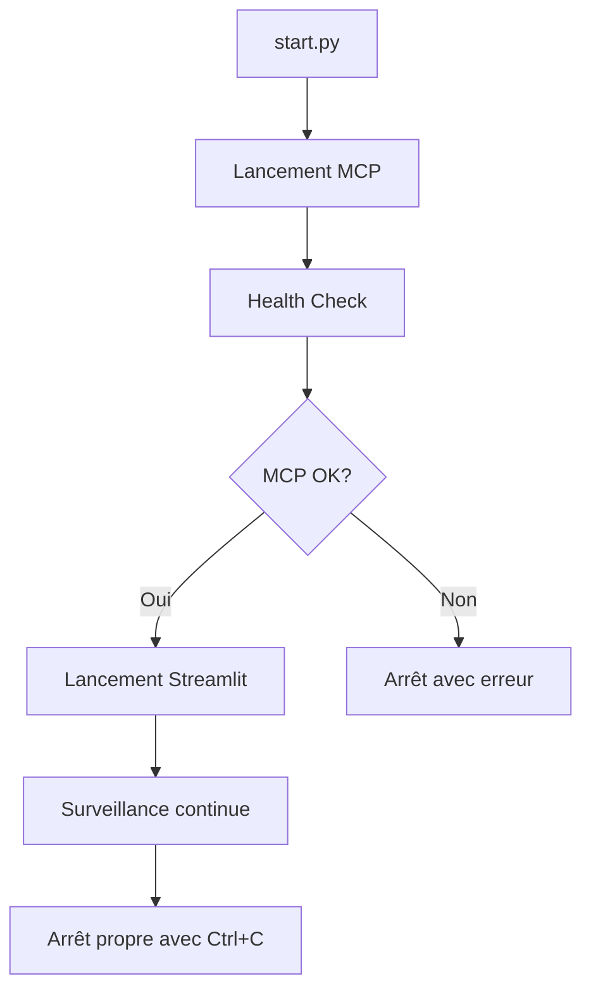

# Script de Lancement RegulAI

Le script `start.py` est le point d'entrée principal pour lancer l'ensemble de l'application RegulAI. Il gère automatiquement le démarrage du serveur MCP et de l'interface Streamlit.

## Fonctionnalités

✅ **Lancement séquentiel** : Lance d'abord le serveur MCP, puis Streamlit une fois que le serveur est opérationnel

✅ **Health Check intelligent** : Vérifie que le serveur MCP répond correctement avant de lancer l'interface

✅ **Gestion des processus** : Arrêt propre de tous les services avec Ctrl+C

✅ **Diagnostics** : Affichage des erreurs et logs en cas de problème

✅ **Configuration flexible** : Ports et timeouts personnalisables

## Usage

### Lancement simple
```bash
python start.py
```

### Options avancées
```bash
# Ports personnalisés
python start.py --port 8080 --mcp-port 9000

# Accessible depuis l'extérieur (attention à la sécurité !)
python start.py --host 0.0.0.0

# Timeout plus long pour le health check
python start.py --timeout 60

# Intervalle de vérification plus fréquent
python start.py --check-interval 0.5
```

### Aide complète
```bash
python start.py --help
```

## Prérequis

1. **Dépendances installées** :
   ```bash
   pip install -r requirements.txt
   # ou
   poetry install
   ```

2. **Configuration MCP** :
   - Le fichier `services/mcp/main.py` doit être présent
   - Les variables d'environnement pour l'API Légifrance doivent être configurées (voir `.env.example`)

3. **Configuration Streamlit** :
   - Le fichier `streamlit_app.py` doit être présent
   - Une clé API OpenAI doit être configurée

## Variables d'environnement

Le script utilise les variables d'environnement suivantes :

| Variable | Description | Défaut |
|----------|-------------|---------|
| `HOST` | Adresse d'écoute pour le serveur MCP | 127.0.0.1 |
| `PORT` | Port pour le serveur MCP | 8000 |
| `MCP_SERVER_URL` | URL complète du serveur MCP | Calculée automatiquement |

D'autres variables sont nécessaires pour le serveur MCP (voir documentation du serveur).

## Dépannage

### Le serveur MCP ne démarre pas

1. **Vérifiez les logs** :
   Le script affiche automatiquement les erreurs du serveur MCP.

2. **Variables d'environnement manquantes** :
   ```bash
   # Vérifiez que les variables OAuth sont définies
   echo $OAUTH_CLIENT_ID
   echo $OAUTH_CLIENT_SECRET  
   echo $OAUTH_TOKEN_URL
   echo $API_BASE_URL
   ```

3. **Dépendances manquantes** :
   ```bash
   pip install httpx fastmcp
   ```

### L'application Streamlit ne démarre pas

1. **Streamlit non installé** :
   ```bash
   pip install streamlit
   ```

2. **Port déjà utilisé** :
   ```bash
   python start.py --port 8080
   ```

### Health check échoue

1. **Augmenter le timeout** :
   ```bash
   python start.py --timeout 60
   ```

2. **Vérifier manuellement** :
   ```bash
   # Dans un autre terminal, une fois le serveur lancé
   curl http://localhost:8000/invoke -X POST \
     -H "Content-Type: application/json" \
     -d '{"method": "tools/list", "params": {}}'
   ```

## Architecture



Le script :
1. Lance le serveur MCP en arrière-plan
2. Effectue des vérifications de santé périodiques
3. Lance Streamlit une fois le MCP opérationnel
4. Surveille les deux processus
5. Assure un arrêt propre de tous les services

## Sécurité

⚠️ **Attention** : Par défaut, les services ne sont accessibles que depuis `localhost` (127.0.0.1).

Si vous utilisez `--host 0.0.0.0` pour rendre l'application accessible depuis l'extérieur :
- Assurez-vous d'être dans un environnement sécurisé
- Considérez l'utilisation d'un reverse proxy (nginx, traefik) avec HTTPS
- Implémentez une authentification appropriée

## Développement

Pour le développement, vous pouvez lancer les services séparément :

```bash
# Terminal 1 - Serveur MCP
cd services/mcp
python main.py

# Terminal 2 - Application Streamlit  
streamlit run streamlit_app.py
```

Cependant, le script `start.py` reste recommandé car il assure la synchronisation entre les services. 