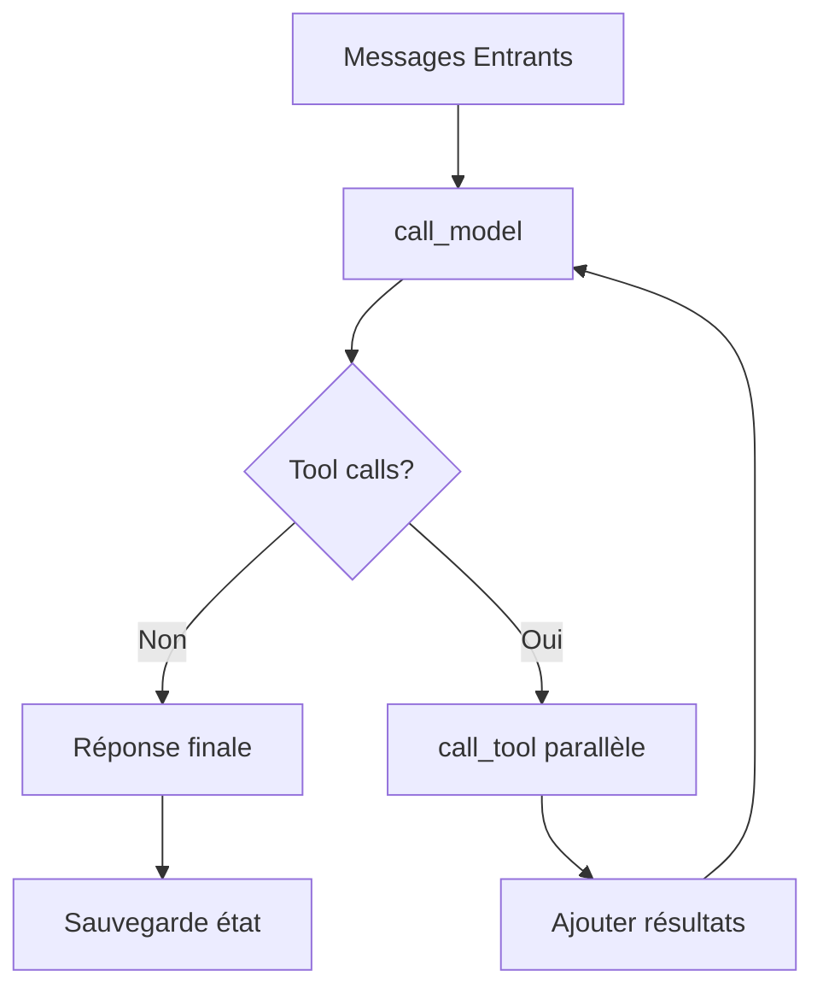

# Guide de l'Agent ReAct LangGraph

## Vue d'ensemble

Cet agent utilise l'**API fonctionnelle de LangGraph** avec le patron d'architecture **ReAct** (Reasoning and Acting) pour interagir intelligemment avec le serveur MCP Légifrance.

## Architecture

### API Fonctionnelle LangGraph

L'agent est construit avec les décorateurs LangGraph :

- **`@task`** : Définit des fonctions asynchrones réutilisables
- **`@entrypoint`** : Point d'entrée principal qui orchestre les tâches

### Composants Principaux

#### 1. Configuration du Modèle

```python
from langchain_openai import ChatOpenAI
model = ChatOpenAI(model="gpt-4o-mini", temperature=0)
```

#### 2. Tâches (@task)

##### `call_model(messages)`
- **Rôle** : Appelle le LLM avec une séquence de messages
- **Entrée** : Liste des messages de conversation
- **Sortie** : Réponse du LLM avec éventuels appels d'outils
- **Implémentation** : `model.bind_tools(tools).invoke(messages)`

##### `call_tool(tool_call)`
- **Rôle** : Exécute un appel d'outil spécifique
- **Entrée** : Objet `tool_call` généré par le LLM
- **Sortie** : `ToolMessage` avec le résultat de l'exécution
- **Implémentation** : Invoque l'outil LangChain correspondant

#### 3. Point d'entrée (@entrypoint)

##### `agent(messages, previous)`
- **Architecture ReAct** : Reasoning (appel LLM) → Acting (exécution outils) → Reasoning...
- **Persistance** : Gestion automatique via `MemorySaver`
- **Parallélisation** : Exécution parallèle des appels d'outils multiples

## Cycle ReAct



### Boucle de Traitement

1. **Raisonnement initial** : Appel du LLM avec l'historique
2. **Décision d'action** : Le LLM décide s'il a besoin d'outils
3. **Exécution parallèle** : Si oui, tous les outils sont appelés en parallèle
4. **Mise à jour du contexte** : Résultats ajoutés à l'historique
5. **Itération** : Retour au step 1 avec le nouveau contexte
6. **Finalisation** : Réponse finale quand aucun outil n'est nécessaire

## Gestion de la Persistance

### Configuration du Checkpointer

```python
from langgraph.checkpoint.memory import MemorySaver
checkpointer = MemorySaver()

@entrypoint(checkpointer=checkpointer)
def agent(messages, previous):
    if previous is not None:
        messages = add_messages(previous, messages)
    # ... logique de l'agent
    return entrypoint.final(value=llm_response, save=messages)
```

### Thread Management

- **Thread ID** : Identifiant unique par conversation
- **Sauvegarde automatique** : État sauvé à chaque interaction
- **Récupération** : Historique restauré automatiquement

## Utilisation

### Configuration de Base

```python
from langchain_core.messages import HumanMessage
from langchain_core.runnables import RunnableConfig

# Message utilisateur
user_message = HumanMessage(content="Recherche des informations sur les congés payés")

# Configuration avec persistance
config: RunnableConfig = {
    "configurable": {"thread_id": "conversation-1"}
}
```

### Modes d'Invocation

#### 1. Mode Streaming (Temps Réel)

```python
for step in agent.stream([user_message], config=config):
    for task_name, message in step.items():
        if task_name == "agent":
            continue  # Ignorer le message final
        print(f"{task_name}: {message}")
```

**Avantages** :
- Visibilité en temps réel des étapes
- Feedback immédiat sur les appels d'outils
- Meilleure expérience utilisateur

#### 2. Mode Invoke (Réponse Complète)

```python
response = agent.invoke([user_message], config=config)
print(response.content)  # Réponse finale uniquement
```

**Avantages** :
- Plus simple pour l'intégration
- Réponse finale directe
- Moins de gestion des événements

### Conversation Multi-Tours

```python
# Configuration persistante
config = {"configurable": {"thread_id": "conversation-persistante"}}

# Premier message
msg1 = HumanMessage(content="Cherche des infos sur le Code du travail")
response1 = agent.invoke([msg1], config=config)

# Deuxième message (avec contexte automatique)
msg2 = HumanMessage(content="Peux-tu être plus spécifique?")
response2 = agent.invoke([msg2], config=config)  # Connaît le contexte de msg1
```

## Intégration avec les Outils MCP

### Découverte Automatique

```python
from .tools import get_available_tools

tools = get_available_tools()
tools_by_name = {tool.name: tool for tool in tools}
```

### Outils Disponibles

1. **`search_legifrance`** : Recherche dans les textes légaux
2. **`get_article`** : Récupération d'articles spécifiques
3. **`browse_code`** : Navigation dans les codes juridiques

### Communication HTTP

Les outils encapsulent la communication HTTP avec le serveur MCP :

```python
# Exemple d'appel automatique
user: "Cherche des informations sur les congés payés"
→ LLM décide d'utiliser search_legifrance
→ HTTP POST vers serveur MCP
→ Résultats intégrés dans la conversation
→ LLM formule une réponse naturelle
```

## Avantages de l'Architecture

### 1. **Modularité**
- Tâches indépendantes et réutilisables
- Séparation claire des responsabilités
- Facilité de test et de débogage

### 2. **Performance**
- Exécution parallèle des outils multiples
- Gestion asynchrone native
- Optimisation automatique par LangGraph

### 3. **Robustesse**
- Gestion d'erreur intégrée
- Persistance automatique des conversations
- Récupération sur défaillance

### 4. **Flexibilité**
- Ajout facile de nouveaux outils
- Configuration modulaire
- Adaptation de la logique ReAct

## Exemples Pratiques

### Exemple 1 : Recherche Simple

```python
python -m src.agent.simple_example
```

### Exemple 2 : Tests Avancés

```python
python -m src.agent.example_usage
```

### Exemple 3 : Validation

```python
python -m src.agent.validate_tools
```

## Dépannage

### Erreurs Communes

1. **Variable d'environnement manquante**
   ```
   OPENAI_API_KEY: [Saisir votre clé]
   ```

2. **Serveur MCP non disponible**
   - Vérifier que le serveur MCP tourne sur le port configuré
   - Tester la connectivité HTTP

3. **Problèmes de persistance**
   - Vérifier l'unicité des thread_id
   - S'assurer que MemorySaver est correctement configuré

### Logs et Debugging

Le streaming mode fournit une visibilité complète :

```python
# Mode verbose pour debugging
for step in agent.stream([message], config=config):
    print(f"Step: {step}")  # Voir tous les détails
```

## Conclusion

Cette architecture combine la puissance du pattern ReAct avec l'efficacité de l'API fonctionnelle LangGraph, offrant un agent intelligent, robuste et facile à maintenir pour l'interrogation du système juridique français via MCP Légifrance. 